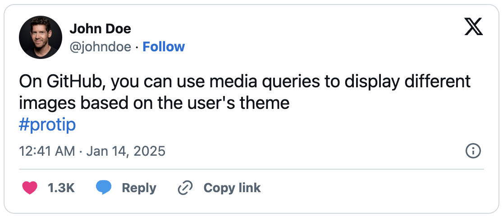

# React Tweet Preview

A React component for previewing tweets before posting, built on top of [react-tweet](https://github.com/vercel/react-tweet). This library focuses on data management and preview functionality, leveraging react-tweet's rendering capabilities.

[](https://paul-pro.github.io/react-tweet-preview)

## Installation

```bash
bun add react-tweet-preview
# or oldfashioned
npm install react-tweet-preview
```

## Usage

<p align="center">
  <picture>
    <source media="(prefers-color-scheme: dark)" srcset="assets/tweet-dark.png" width="550px">
    <source media="(prefers-color-scheme: light)" srcset="assets/tweet-light.png" width="550px">
    
  </picture>
</p>

```tsx
import { TweetPreview } from 'react-tweet-preview';

function App() {
  return (
    <TweetPreview
      content="On GitHub, you can use media queries to display different images based on the user's theme\n#protip"
      author={{
        name: 'John Doe',
        username: 'johndoe',
        image: 'https://avatars.githubusercontent.com/u/1?v=4',
      }}
      favorite_count={1337}
    />
  );
}
```

## Props

\* Required props

| Prop | Type | Description | Default |
|------|------|-------------|---------|
| `content` * | `string` | The content of the tweet (limited to 280 characters) | - |
| `author` | `object` | Author information object | 👇 |
| `author.name` | `string` | Display name | `'User'` |
| `author.username` | `string` | Twitter handle (without @), automatically converted to lowercase and stripped of whitespace | `'user'` |
| `author.image` | `string` | URL to profile picture | Default Twitter avatar |
| `author.is_verified` | `boolean` | Whether the user has a blue checkmark | `false` |
| `theme` | `'light' \| 'dark'` | Theme mode for the tweet preview | `'light'` |
| `created_at` | `Date` | Tweet creation timestamp | Current date/time |
| `favorite_count` | `number` | Number of likes, renders action buttons when provided | `undefined` |
| `image` | `string` | URL of the image to attach to the tweet | `undefined` |
| `in_reply_to_screen_name` | `string` | Username of the tweet being replied to | `undefined` |
| `quoted_tweet` | `object` | Tweet being quoted | `undefined` |
| `quoted_tweet.content` | `string` | Content of the quoted tweet | - |
| `quoted_tweet.author` | `object` | Author information for the quoted tweet (same structure as `author`) | Same defaults as `author` |
| `quoted_tweet.created_at` | `Date` | Creation timestamp of the quoted tweet | Current date/time |

## Features

- Seamless integration with react-tweet for rendering
- Automatic tweet data structure generation
- Tweet length validation
- Automatic parsing and linking of:
  - @mentions
  - #hashtags
  - URLs
- Fallback handling for missing author information
- Like count and action buttons support
- Image attachment support with automatic size detection
- Reply to tweet support
- Quote tweet support

## Development

For detailed development instructions and guidelines, see [CONTRIBUTING.md](CONTRIBUTING.md).

Oneliner start:
```bash
bun i && bun run storybook
```

## Roadmap

Future improvements and features we're considering:

- [ ] Add example of a tweet posting
- [ ] Real quote tweet support
- [ ] Tweet thread support
- [ ] Use storycap to refresh readme image

## License

MIT
